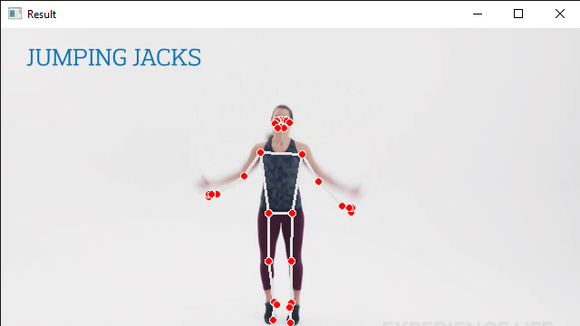
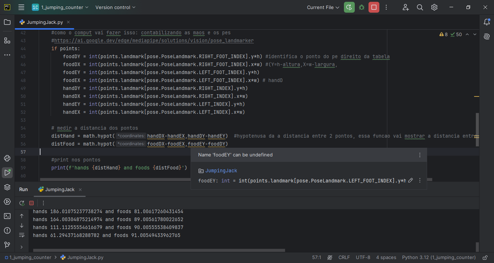
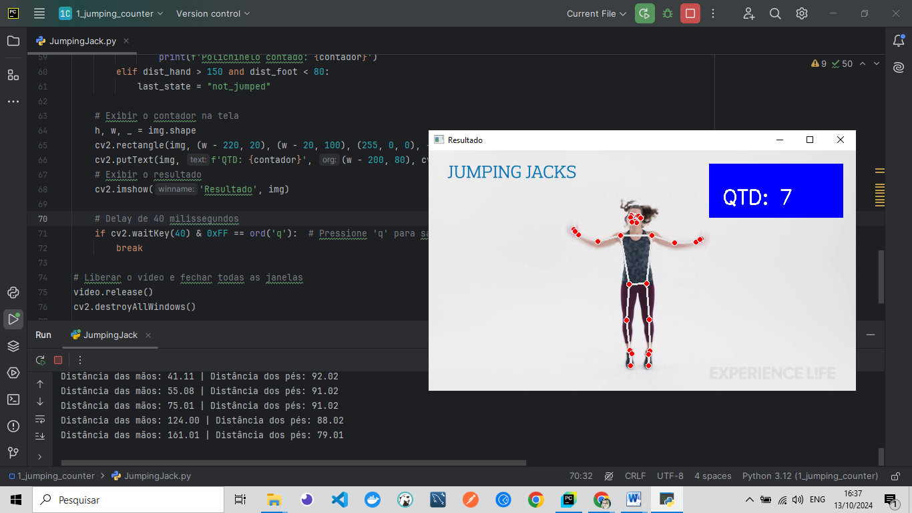
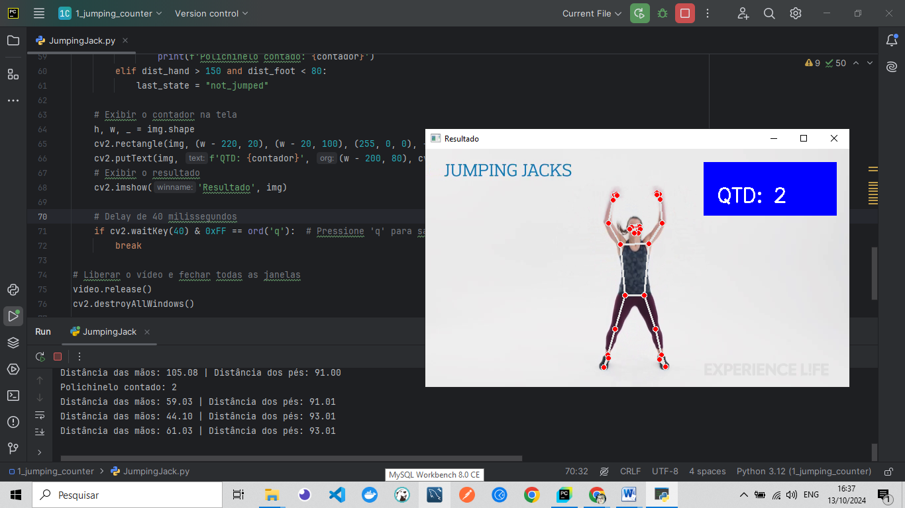

<h2 align="center"> 💻 Deteccao_obj_MediaPipe_Python </h2>
<br>

<h4 align="center"> 💻 Deteccao_obj_MediaPipe_Python => 
A Jumping Jack Counter project that uses computer vision to count jumping jacks in a video using Python, OpenCV, and MediaPipe. The application detects body landmarks and counts the number of jumping jacks based on the distance between hands and feet.
</h4>
<br>

---
## Facial Recognition with Video Project
- This project uses the face-api.js library to implement a facial recognition system based on video captured from the device's camera. The application detects faces, identifies facial landmarks, emotions, age, and gender, and performs facial recognition using pre-trained descriptors. The interface includes buttons to start and stop the video, and the recognition process occurs in real-time.

---

<h4 align="center">Face Detection Project with face-api and JS 🚀</h4>

<div align="center">
    
     
</div>
<br />
<br />

<div align="center">
    
     
</div>

---

## Table of Contents
- Features
- Technologies Used
- Installation
- Usage
- Code Explanation
- License

---


## Features

- Detects body landmarks using MediaPipe.
- Counts jumping jacks based on hand and foot positions.
- Displays the count in real-time on the video feed.
- Easy to use with any video file.

---


## Technologies Used
- Python
- OpenCV
- MediaPipe
- NumPy
- Math

---

## Installation

1 - Clone the repository:

```bash
git clone https://github.com/ludiemert/Deteccao_obj_MediaPipe_Python.git
cd jumping-jack-counter
```

2 - Create a virtual environment (optional but recommended):
```bash
python -m venv venv
source venv/bin/activate  # On Windows use `venv\Scripts\activate`
```

3 - Install the required packages:
```bash
pip install opencv-python mediapipe
```

---

## Usage

Run the script with Python:

```bash
python jumping_jack_counter.py

```
-Press q to exit the video feed.

---

## Code Explanation

The main script jumping_jack_counter.py contains the following key components:

 - Video Capture: Opens a video file and processes it frame by frame using OpenCV.
 - Body Detection: Uses MediaPipe to detect body landmarks, specifically focusing on hands and feet.
 - Distance Calculation: Calculates the distance between the hands and the feet to determine if a jumping jack has been performed.
 - Counting Logic: Increments the counter based on the detected positions of the hands and feet.
 - Real-time Display: Displays the count on the video feed.

Here’s a brief overview of the code:
```bash
import cv2
import mediapipe as mp
import math

# Open video
video = cv2.VideoCapture('jumping_jack.mp4')

# Body detection setup
mp_pose = mp.solutions.pose
pose = mp_pose.Pose(min_tracking_confidence=0.5, min_detection_confidence=0.5)
mp_drawing = mp.solutions.drawing_utils

# Counter initialization
counter = 0
last_state = None

# Loop through video frames
while True:
    success, img = video.read()
    if not success:
        break
    img = cv2.resize(img, (640, 360))
    img_rgb = cv2.cvtColor(img, cv2.COLOR_BGR2RGB)
    results = pose.process(img_rgb)

    if results.pose_landmarks:
        # Draw landmarks and calculate distances...
        # (Logic for counting jumping jacks)
    
    cv2.imshow('Result', img)

    if cv2.waitKey(40) & 0xFF == ord('q'):
        break

video.release()
cv2.destroyAllWindows()

```

---
## License
- This project is licensed under the MIT License.
---


### 📦 Contribution

 - Feel free to contribute by submitting pull requests or reporting issues.

- #### My LinkedIn - [](https://www.linkedin.com/in/lucianadiemert/)

#### Contact


#### [**Luciana Diemert**](https://github.com/ludiemert)

🛠 Full-Stack Developer <br>
🖥️ Python Enthusiast | Computer Vision | AI Integrations <br>
📍 São Jose dos Campos – SP, Brazil

<a href="https://www.linkedin.com/in/lucianadiemert" target="_blank"></a>&nbsp;
<a href="mailto:lucianadiemert@gmail.com" target="_blank"></a>&nbsp;
<a href="#"></a>&nbsp;
<a href="https://www.github.com/ludiemert" target="_blank"></a>&nbsp;

<br clear="left"/>
